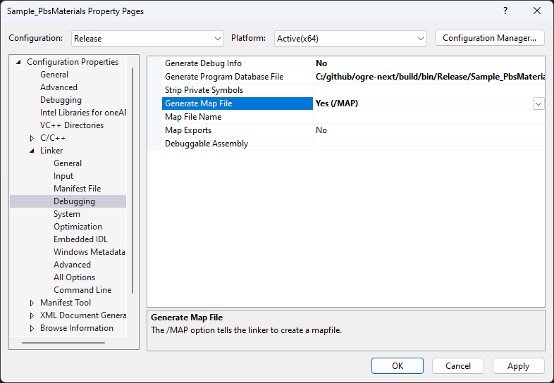

+++
date=2025-04-10
title="應用程式怎麼那麼肥? 用 Link Map 分析執行檔體積"
draft = true
[taxonomies]
tags = ["開發日常", "C++"]
+++

你注意過程式執行檔的大小嗎？你有想過為什麼應用程式那麼肥嗎？如果你有類似的疑問，本文分享了我用分析自己開發的程式檔案大小的方法 -- 透過 Link Map。

### Visual Studio 產生 Link Map 

分析前，要先產生 Link Map 檔案。

作法是開啟 Visual Studio 專案的 Property -> Linker -> Debugging -> Generate Map File ，然後選擇 Yes



也可以直接添加連結器選項 `/MAP`，比如說在 CMake 的 CMakeLists.txt 裡面，加入這行：

```cmake
target_link_options(${PROJECT_NAME} PRIVATE "/MAP")
```

這樣就會在專案的輸出資料夾裡面，產生一個 `.map` 檔案。

### 這個檔案是什麼？

Link Map 檔案是編譯器產生的報告，裡面有關於程式碼編譯後的資訊。
它會列出每個模組的大小、百分比、以及它們在記憶體中的位置。
這些資訊可以幫助我們了解執行檔的組成結構，並找出哪些模組佔用最多空間。

### Link Map 檔案的內容

Link Map 檔案的內容有點複雜，這裡簡單介紹一下。

```plaintext
Address             Size     Name        
```

這一行是標題，後面會有三個欄位：
- Address：模組在記憶體中的位置
- Size：模組的大小
- Name：模組的名稱


### 問題: 不能超過45MB

這年頭很少人在關注應用程式的體積了，硬碟便宜，網路快，一支應用程式的體積到底是 10MB 還是 100MB，一般人大概不太在意。

但是在特定情形下，還是要計較一下體積的。

我這次碰到的危機，就是工作上的產品硬體有嚴格的限制，內嵌軟體必須小於45MB，否則就放不進硬體裡。但是就這麼不巧，編譯出來的軟體有52MB這麼大，超過了45MB。

增加硬體規格是不可能的，因為大量產品已經在市場上流通。唯一辦法是縮小執行檔體積，塞進有限的硬體空間裡。

### 為什麼要分析檔案體積

團隊裡很多人提出了想法，像是拔掉很少人用的甲功能，移除實驗性的乙功能，或者刪除用不到的模組等等。但是不管哪個方法，我們都碰到一個困難：動手前，怎麼先得知可以減掉多少體積？

很可能，工程師花了三天時間拔掉甲功能，結果只縮減了50KB，對於整體大局根本沒有影響。

所以我們想要先有一份檔案體積分析報告，說明每個模組佔用的大小和百分比。否則我們根本沒辦法評估哪個作法有效，能不能達成。

我研究了之後，發現編譯器可以產生一個東西叫 Link Map，內含我們需要的資訊。
### 參考連結
[/MAP (Generate Mapfile) | Microsoft Learn](https://learn.microsoft.com/en-us/cpp/build/reference/map-generate-mapfile?view=msvc-170)